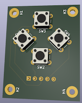

# CTRL.ALT GameCraft 2023

Repo holding the hardware and code behind the controller components used in https://www.gamecraft.it/events/altctrljam-2023/

# Hardware

A [Raspberry Pi Pico](https://www.raspberrypi.com/products/raspberry-pi-pico/) running [CircuitPython](https://circuitpython.org/board/raspberry_pi_pico/) acts as a HID keyboard device.

Two (or more) button pads are connected to the Pico using jumper cables. Each button pad has 4 buttons.

You can position these anywhere you want on an alternative controller. Embed them in cardboard, stick onto things, etc.

[KiCad](https://www.kicad.org/) is used to design the boards. You can even see me following the tutorial in [kicad-tutorial](./kikad-tutorial/)!

[JLCPCB](https://jlcpcb.com/) was used to print the boards. Elbow grease and lots of solder was used to assemble the boards.

The schematics can be found in [dpad](./dpad/).

# Software

The Pico runs [CircuitPython](https://circuitpython.org/) and uses Adafruit's HID library to emulate a keyboard. It's also possible to emulate a mouse and a gamepad (there are some experiments for gamepad emulation in [experiments](./src/alt_controller_jam/experiments/)).

Code execution order:

1. [boot.py](./boards/circuitpython/boot.py) is run *once* on board startup to configure it. Here we enable keyboard emulation. If you change this you need to unplug and plug the board back in. If you want to pretend to be a mouse or gamepad this is where you do it.
2. Next [code.py](./boards/circuitpython/code.py) is run to configure the button mapping and listen for events. Editing this should immediately restart the code and use your changes. If you need to change the button mappings this is where you do it.

When running the library code lives in `lib` on the pico but lives in [src](./src/) here in GitHub.

- [alt_controller_jam.configurations](./src/alt_controller_jam/configurations.py) contains different example keyboard mappings you can use.
- [alt_controller_jam.hardware](./src/alt_controller_jam/hardware.py) contains mappings for pins.
- [alt_controller_jam.keyboard](./src/alt_controller_jam/keyboard.py) contains the code which acts as a keyboard, responding to GPIO pins (button clicks) and sending out keycodes.

# Building and Deploying to a Pico

[just](https://just.systems/) is used to run the build and deployment steps.

[poetry](https://python-poetry.org/) is used to manage local tool dependencies. It's also used to install libraries into your development environment, but these won't allow you to run the code on your desktop. They're primarily intended to allow for error checking.

Note that the default paths in the [justfile](./justfile) are Apple Mac defaults, you'll need to adjust them for your machine.

1. To install dependencies: `poetry install`
2. To build: `just build`
3. To flash CircuitPython onto a Pico:
    1. Hold down the `bootsel` button on the Pico while plugging in the USB cable into your machine
    2. Keep holding it down until a `RPI-RP2` disk is mounted
    3. Run `just install-firmware`
4. To deploy the built code onto the pico: `just deploy`

You can make this process a little more efficient using:

1. Run `just watch` to see which disk is mounted
2. After plugging in the pico use `just install-firmware && just deploy && just eject` in another terminal to flash the firmware and install the code in one step.
